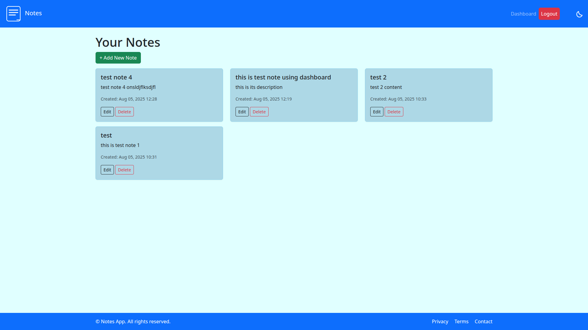
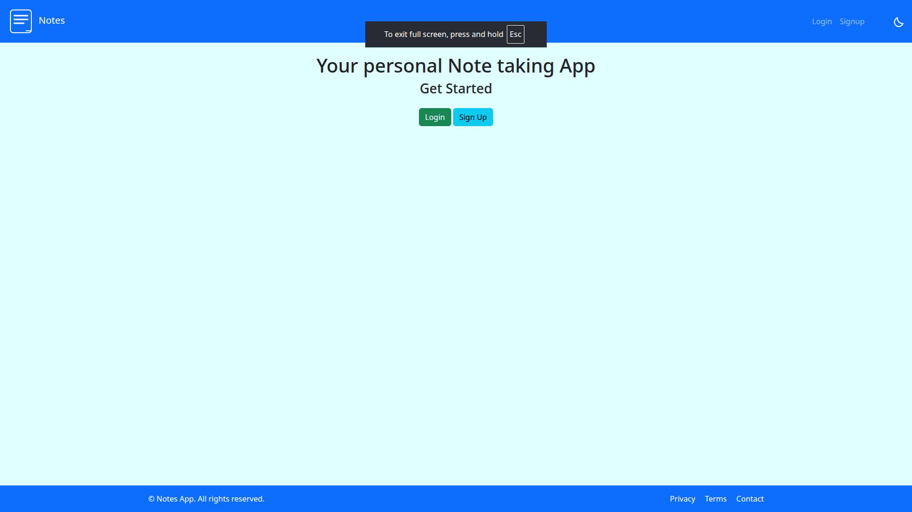

# 📝 Classroom Notes App

A Django web app where registered students can create, view, and delete personal notes. Each note is displayed like a sticky note. Users must log in to manage their own notes.

---

## 🔍 Features

- User Registration and Login  
- Create, View, and Delete Personal Notes  
- Sticky Note UI for notes  
- Secure (Only logged-in users can access their own notes)

---

## 📸 Screenshots

  

---

## 🚀 How to Run Locally

1. Clone the repo  
   `git clone https://github.com/your-username/classroom-notes-app.git`  
   `cd classroom-notes-app`

2. Create a virtual environment and install dependencies  
   `python3 -m venv venv`  
   `source venv/bin/activate`  
   `pip install -r requirements.txt`

3. Run migrations  
   `python manage.py migrate`

4. (Optional) Create a superuser  
   `python manage.py createsuperuser`

5. Run the development server  
   `python manage.py runserver`

---

✅ Open `http://127.0.0.1:8000/` in your browser to start using the app.
